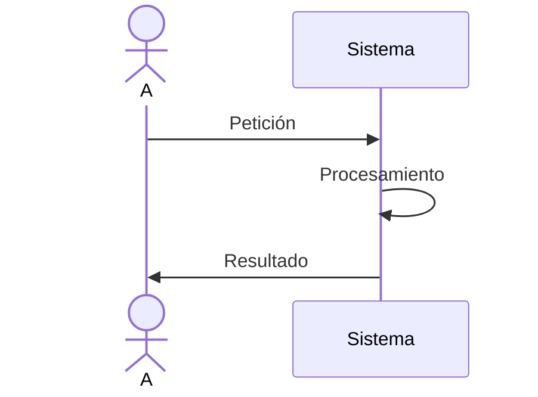

# Abstracción - Confía en las cajas negras ¡Y mucho!

Si algo aprendí con el paso del tiempo, y hoy en día me doy cuenta que beneficia un montón en lo que es el diseño de software y arquitectura del mismo es a confiar en lo que se supone que debe hacer el sistema.

A veces, simplemente no tener idea de cómo hace las cosas (o ignorarlas) nos puede traer a nosotros la necesidad de abordar los problemas de determinada manera o nos abre las puertas a jugar con la implementación de distintas funcionalidades sin miedo a romper cosas.

Cuando digo confía en lo que se supone que debe hacer el sistema es traer a nosotros el misterio de la caja negra, es la abstracción de las funcionalidades, es tener presente que no podemos estar en todos lados. Existen muchísimas herramientas para lograr esto y se crearon para poder hacer el trabajo de todos mucho más fácil: Interfaces, documentación, clases abstractas, composición de objetos, arquitecturas limpias, etc. Todos los lenguajes lo tienen en mayor o menor medida, pero siempre está ahí.

Suponete que tenes que hacer un reporte dado una base de datos ¿Te importa cómo se llenó esa base de datos? Para nada, te importan los datos; Tenes que cambiar de host a tu aplicación ¿Por qué deberías modificar tu código?; queres envíar emails por gmail o el mismo mensaje por sms ¿Te importa cómo hace Google o un proveedor de sms? Para nada. En tus programas tiene que ser igual.

