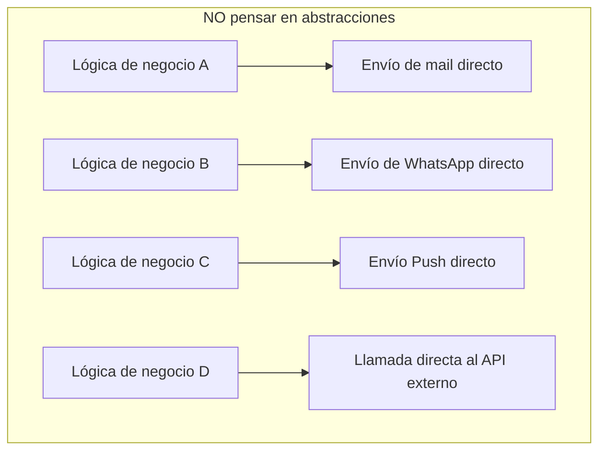
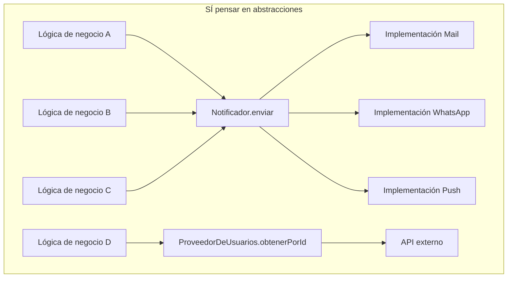

# Pensar en abstracciones: una forma más sana de programar

Cuando estamos programando, muchas veces nos metemos tan de lleno en resolver el problema puntual que tenemos en frente que nos olvidamos de algo clave: la manera en que lo estamos resolviendo importa tanto como la solución en sí. Pensar en abstracciones no es algo reservado solo para arquitectos de software o diseñadores de sistemas; es una forma de pensar que puede hacer que cualquier código, desde un script hasta una aplicación completa, sea más fácil de entender, mantener y evolucionar.

¿Pero qué significa realmente "pensar en abstracciones"? En pocas palabras, es dejar de enfocarse en los detalles innecesarios y empezar a mirar los patrones, las ideas generales detrás de lo que estamos construyendo. Es como decir: “no necesito saber cómo funciona el motor, solo necesito saber cómo conducir el auto”. En programación, eso se traduce en crear funciones, clases o módulos que oculten la complejidad y expongan solo lo que realmente necesitamos para trabajar con ellos. Y eso, aunque no lo parezca, ahorra un montón de dolores de cabeza.

Por ejemplo, imaginemos que tenemos que desarrollar una funcionalidad para enviar notificaciones. Podríamos empezar escribiendo código para mandar un mail, después un mensaje de WhatsApp, después una notificación push… y sin darnos cuenta, terminamos con una lógica mezclada por todos lados. Pero si nos abstraemos y pensamos en términos de “canal de notificación”, podemos definir una interfaz común —algo como Notificador.enviar(mensaje)— y después implementar cada canal por separado. Esto nos da la libertad de agregar o cambiar un canal sin tocar todo lo demás. Esa separación clara de responsabilidades es un beneficio directo de pensar en abstracciones desde el principio.

Lo mismo pasa cuando nuestro sistema necesita interactuar con otro. Supongamos que tenemos que conectarnos con un servicio externo para obtener información de usuarios. Podríamos hacer llamadas HTTP directo desde todos lados, pero eso haría que nuestro sistema dependa demasiado de ese proveedor. En cambio, si abstraemos esa dependencia detrás de algo como ProveedorDeUsuarios.obtenerPorId(id), podemos aislar el resto del sistema de los detalles de implementación. Si mañana cambia el proveedor, o si queremos mockear esa funcionalidad en los tests, lo único que tenemos que modificar es esa capa. De nuevo, las abstracciones nos permiten adaptarnos sin tener que rehacer todo.

Uno de los grandes beneficios de trabajar así es que empezamos a hacer nuestro código más reutilizable. En vez de repetir la misma lógica en cinco lugares distintos, podemos encapsularla y usarla donde haga falta. Eso no solo hace que el código sea más limpio, sino que también nos ayuda a detectar errores más rápido, porque todo está en un solo lugar. Y si llega alguien nuevo al equipo, va a tener un camino mucho más claro para entender cómo están armadas las cosas.

Además, pensar en abstracciones nos obliga a ordenar nuestras ideas. Cuando tenemos que definir una interfaz o un contrato entre partes del sistema, estamos tomando decisiones importantes: qué hace cada componente, qué debería saber y qué no. Eso evita que las piezas se mezclen sin control. Cuando cada cosa tiene su rol bien definido, es mucho más fácil hacer cambios sin romper todo lo demás. Es como construir una casa donde cada ambiente tiene su función: sabés que si querés cambiar el baño, no vas a tener que tirar abajo la cocina.

Al final, abstraer no es complicar: es simplificar. Es una manera de cuidar nuestro propio trabajo y también el de quienes vengan después. Porque un buen diseño no se nota tanto cuando todo funciona, pero se vuelve fundamental cuando algo falla o necesita cambiarse. Pensar en abstracciones es una forma de dejar el código un poco mejor de lo que lo encontramos. Y eso, en un mundo que cambia todo el tiempo, es un regalo para nuestro futuro yo (y para el equipo también).